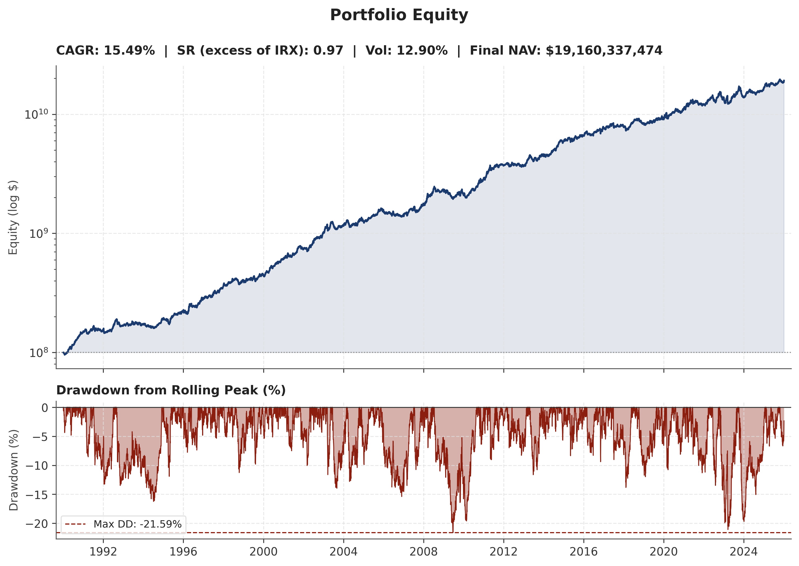
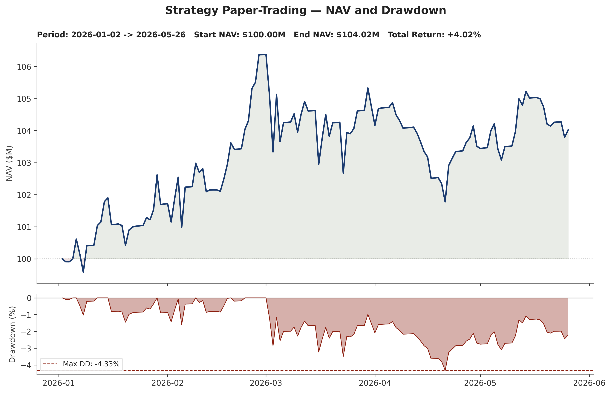

# Trends Research — Systematic Momentum in Global Futures

**A Master's-thesis research programme on serial autocorrelation and trend-persistence in linear derivatives.**
MSc 2 Mémoire, INSEEC — *Lucas Joly*.

This repository is the curated, presentation-facing extract of a ~36-year systematic
trading research project: a from-scratch C++/Python backtesting engine, a library of
45 individually-tested alpha signals, a flagship multi-alpha strategy validated with an
institutional statistics battery, and a GAN-based synthetic-market robustness pipeline.

> **Research question.** Can a systematic multi-alpha futures strategy — where *every
> parameter is derived from first principles or sourced from the academic literature,
> with zero fitted parameters* — deliver a return premium that survives the most
> adversarial multiple-testing correction?

> **Note.** This is a **read-only showcase**. The source is shared for review, not
> execution: the proprietary NorgateData price panel and the data-loading layer
> (`shared_config`, `Data/`) are private, so the scripts here reference them but do not
> ship them. Read the code and results — don't expect `python …` to run end-to-end.

---

## Headline result — Strategy S183 (`IG VoV Quad Sharpened`)

A four-alpha, equal-weight composite (Time-Series Trend · Carry · Skew · Vol-of-Vol) on a
frozen universe of **62 liquid futures**, backtested day-by-day over **1990–2026 (≈9,341
trading days)** on the Carver (2023) forecast-to-position framework.

| Metric | Value |
|---|---|
| Raw annualised Sharpe (excess of T-Bill) | **0.97** |
| **BHY-corrected Sharpe** (Harvey–Liu, K = 118 audited trials) | **0.78** |
| CAGR | 15.5% |
| Annualised volatility | 12.9% |
| Max drawdown | 21.6% |
| Calmar | 0.72 |
| Fama–French 5-factor alpha | 10.6% (t = 3.21, p = 0.0013) |
| Fung–Hsieh 7-factor alpha | 13.0% (t = 5.83) |
| Decade Sharpes (90s / 00s / 10s / 20s) | 0.90 / 1.02 / 1.19 / 0.74 |
| Performance retained under T+1 execution lag | 98.1% |

**Why it's honest.** S183 has *zero parameters optimised on the backtest* — each value is
either a closed-form derivation (e.g. `FDM_CAP = √4 = 2.0`, sigmoid steepness `= 2/vol_target`)
or a literature citation (EWMAC speeds from Levine & Pedersen 2016; Vol-of-Vol direction
from Baltussen et al. 2018). Robustness is established across a Deflated-Sharpe test
(z = 4.28), a 1,000-draw Monte-Carlo parameter search (realised SR in the top 1.8%),
signal-shuffle null tests (24–33σ above null), and a WGAN synthetic-market stress test.

---

## Out-of-sample paper trading (Jan–May 2026)

The strategy was run forward on **145 trading days of genuinely out-of-sample data**
(2 Jan – 26 May 2026) that did not exist when the model was frozen — a live-with-fake-money
proof of concept, not a backtest.

| Metric (145 days) | Value |
|---|---|
| Sharpe (excess of T-Bill) | +0.44 |
| Annualised return | +7.33% |
| Annualised volatility | 8.56% (well below the 20% target — conservative by design) |
| Max drawdown | −4.33% |

**Honest read.** The sample is far too short for statistical significance. In this strongly
risk-on window the strategy underperformed equity and CTA benchmarks on return, dragged by a
synchronous trend reversal in agriculturals — but it held the smallest drawdown of the peer
set, and its return distribution (skew, kurtosis) matched the 36-year backtest almost exactly
at a lower scale. Against 10,000 bootstrapped historical 145-day windows the realised result
sits around the 33rd percentile on return/Sharpe. A fuller update is scheduled for the
September 2026 defence; meaningful live conclusions need 2–3 years of data.

---

## Repository map

| Folder | What's inside |
|---|---|
| [`thesis/`](thesis/) | Compiled thesis (French corpus + annexes, full English translation) and the S183 technical report (PDF). |
| [`engine/`](engine/) | The backtesting framework: shared compounding engine, a **C++ (pybind11) accelerator** for the day-by-day walk-forward, a Gaussian-HMM regime detector, and a Bayesian (NumPyro/JAX) latent-factor risk filter. |
| [`flagship_S183/`](flagship_S183/) | The flagship strategy source, its 1,000-line technical report, result figures, and the robustness-run scripts (half-life sweep, liquidity-weighting, signal-shuffle, capacity analysis). |
| [`alpha_library/`](alpha_library/) | **45 individually-backtested alpha signals**, each a standalone module, plus the cross-alpha correlation matrix and performance summary. |
| [`gan_robustness/`](gan_robustness/) | A conditional-WGAN pipeline that trains a generative model on the real market panel and re-runs the strategy on synthetic paths to test for backtest overfitting. |

---

## The alpha library at a glance

45 signals were each isolated, backtested over the full 1990–2026 window, and ranked. The
strongest standalone sleeves (below) are the raw material for the S183 composite; the point of
the exercise is that the *combination* — not any single signal — is what survives correction.

| Top standalone alphas | Full-sample Sharpe | CAGR |
|---|---|---|
| EWMAC Ensemble (trend) | 0.57 | 14.3% |
| EWMAC Slow | 0.57 | 14.2% |
| Normalised Momentum | 0.56 | 14.4% |
| Carry | 0.48 | 9.6% |
| Skew | 0.48 | 10.6% |

*Full ranking of all 45 in [`alpha_library/single_alpha_summary.csv`](alpha_library/single_alpha_summary.csv).*

---

## Method & stack

- **Data** — ~110 continuous futures (Panama-adjusted) from NorgateData across equities,
  rates, bonds, FX, commodities, volatility, carbon and crypto; frozen universe, strict
  5-year per-instrument out-of-sample gate, no survivorship bias.
- **Engine** — vectorised NumPy signal generation → shared date-alignment → day-by-day
  walk-forward P&L and compounding (C++ accelerated) → geometric metrics. Position sizing
  via Carver forecast-to-position with a universe-pooled 4×4 Forecast Diversification
  Multiplier and sigmoid vol/drawdown overlays.
- **Statistics** — Newey–West HAC Sharpe SEs, Jobson–Korkie–Memmel paired tests,
  Ledoit–Wolf block bootstrap, Deflated Sharpe (Bailey & López de Prado), Harvey–Liu–Zhu
  multiple-testing haircut, Fama–French 5F / Fung–Hsieh 7F factor regressions.
- **Tooling** — Python (NumPy, Pandas), C++ (pybind11), PyTorch (WGAN), NumPyro/JAX
  (Bayesian filter), LaTeX (thesis).

---

## Thesis

- **[Mémoire — Corpus](thesis/Memoire_FR_Corpus.pdf)** · **[Annexes](thesis/Memoire_FR_Annexes.pdf)** (French)
- **[Full English translation](thesis/Memoire_EN.pdf)**
- **[S183 technical report](thesis/S183_Final_Report.pdf)** — the complete strategy write-up, testing suite, and adversarial-critique section.

*Title: “Autocorrélation sérielle et phénomènes de persistance des tendances sur les
dérivés linéaires.” Tuteur de mémoire : Georges Lionel.*

---

## Contact

**Lucas Joly** — MSc 2 Finance, INSEEC.
[LinkedIn](https://www.linkedin.com/in/lucas-joly-315513331/) · [joly.lpro@gmail.com](mailto:joly.lpro@gmail.com)

*Research self-financed. This repo is a curated extract of a much larger private research
codebase; it is shared for academic and professional review.*
